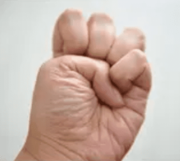

# 金刚长寿功

[TOC]

由招熟而渐悟懂劲，由懂劲而阶及神明。

式之所动，劲之所生，欲右而先左，欲紧而先松，反而后动，灭而后生。

气息收发，随劲行止，无意则中，清静则归，关心则乱，必固则失。

明此要诀，以习神功。

## 一、八部金刚功<small>（日练·阳法）</small>

> **双手插顶利三焦**，**手足前后固肾腰**。
>
> **调理脾肤需单举**，**左肝右肺如射雕**。
>
> **回头望足去心疾**，**五劳七伤往后瞧**。
>
> **凤凰展翅周身力**，**两足顿顿饮嗜消**。
>
> <small>（顺序：三焦、水、土、木、金、火，扫除五劳七伤，畅通周身经血，促进积食消化）</small>

### 起式

两脚开立，双手落于体侧。

双手绷劲后拧一次。

双手绷劲后拧两次。

双手绷劲后拧三次。

双手上提，气归中宫。

### 第一部：双手插顶利三焦

双手下放。

体侧伸平。

立掌。

向上会和于头顶。

并掌。

冲天。

落掌放平。

勾掌。

气归中宫。

x9。

### 第二部：手足前后固肾腰

合掌左进开脚。

前冲。

分开。

弓步落后。

掌根合拢，合掌上提。

隔空下推。

伸平起身。

合掌收回。

换向。

x9。

方拳收脚，气归中宫。

> “合掌上提”这一步并不简单，他不是靠寸劲冲上去，而是靠内劲涌上去的。
>
> 同时，标准动作要求在上提过程中，始终保持掌根合拢，这个动作很像瑜伽中的双手背后合十式，只是金刚功的合掌动作指尖向下，瑜伽是指尖向上。
>
> 平时可以尝试利用座椅靠背、墙壁等借助外力，或用向后猛拍掌上提的寸劲将掌根于背后合拢紧贴后背，挺胸抬头，利用衣服的摩擦力卡住坚持一小会儿，假以时日，必有成就。

### 第三部：调理脾肤需单举

左开大步。

拳移左腰，左立拳如招财之猫，右平拳如覆食之碗。

开拳换掌，侧方脚跟向后外旋拧成平行站位，弓步上举下按。

内旋翻手，方拳回收。

拳移右腰，右立拳如招财之猫，左平拳如覆食之碗。

x9。

方拳收脚，气归中宫。

> “弓步上举下按”这一步的“步法”很重要！它是上举下按的同时，侧方脚以脚尖为轴、脚跟向后向外旋，将双脚从开始的外八站位调整为平行站位，然后弓步上举下按，行气才能通达顺畅。

### 第四部：左肝右肺如射雕

左开大步。

双拳向左出掌伸平。

反向轮转上过头顶。

一次触底。

二次触底收拳。

左倾身体右压拳，内旋翻掌上经面。

逆向轮转，绕体推出。

起身搭箭。

拉弓。

探身存距，前手翻掌标出。

收拳换向。

x9。

双拳向左出掌伸平。

反向轮转上过头顶。

一次触底。

二次触底。

方拳收脚，气归中宫。

> “倾身、举弓、搭箭、拉弓、放箭”，这五步按先后顺序，一步步来，保持节奏，不可连做。
>
> 拉弓手的力点着意在食指第二指节，小臂并非平行于地面，而是稍稍向下倾斜，挺胸充肺，力集肩背，要用后背上部肩胛撑力，这样才能气定神闲，通体舒展。

### 第五部：回头望足去心疾

左开大步。

左手舀水，经腰圆转，相对贴身下插，伸平朝内。

右手提气，经面下按弓步，掌心朝外，上前推出。

回头望足，微视后脚脚跟。

前冲后覆，外旋翻掌。

收拳换向。

x9。

方拳收脚，气归中宫。

> 这一部最后的伸展动作不容易协调，其实奥秘就是四个字：相对运动！
>
> 为便于描述，称向前的手为“按推手”，向后的手为“下插手”。
>
> 最后伸展的诀窍在于：下插手绝对位置不动！从腰间盘转至体侧以后，就等着按推手动作：前手“按”下弓步的同时身体迁移，此时下插手相对身体自然到位，前手“推”的同时后手直接运气伸展，确认步型“弓蹬”（前腿弓、后退蹬）即可。此动作伸展到位后，气脉极其通畅。

### 第六部：五劳七伤往后瞧

叉手上提。

下按。

头引体转，体带头回。

先左后右，归正脊柱。

x9。

翻掌散手，方拳收回，气归中宫。

> 这一部是治病的，要点在于：**两眼似闭非闭，观想五脏六腑，致虚极，守静笃，气运病灶。**
>
>  

### 第七部：凤凰展翅周身力

左开大步。

双拳向左出掌伸平。

反向轮转上过头顶。

一次过顶。

二次过顶。

三次过顶。

顺势侧身，右手惯落而后劈，腰引左手三点地。

回手起身换方向。

x9。

双拳向左出掌伸平。

反向轮转上过头顶。

一次过顶。

一次触底。

方拳收脚，气归中宫。

> “凤凰三点头”的步法是
>
> 点头的要点是下腰，而不是弓背。后手像是被人反擒住向上扳，形成对拉杠杆，上下通臂。通臂的意义，在于视臂膀为一个，即“一条臂膀，两个拳头”，两臂相通，阴阳互济，在物理上就是动量守恒。
>
>  

### 第八部：两足顿顿饮嗜消

叉手上提。

下按。

并足叩齿。

提踵下振。1-2-345。

x9。

两脚开立。

### 收功

翻掌散手，指立对挤。

上提经面，分起两肩，经两胁缓缓落下，收功圆满。

张手分指，反复握拳，放松腿脚，原地跑跳，拍打折臂，放松自然。

> **要点总结：**
>
> 1. 功理顺序：先通三焦，发动全身气机。
>
>    再按「**肾**水、**脾**土、**肝**木、**肺**金、**心**火」序锻炼脏腑。
>
>    肾为先天之本，先固肾腰。
>
>    脾为后天之本，再调脾肤。（肤指皮肤与肌肉之间的隔膜细胞组织）
>
>    继而肝肺，最后君主之官。
>
>    练后，再行扫除五劳七伤。
>
>    凤凰展翅，畅通全身经络与循环气血。
>
>    两足顿顿，消解饮食阻滞与不良嗜好。
>
> 2. **收功式一定要做**，无论您练了哪部，休息前都要完成收功式。
>
>    不收功则散开元气不能归聚，就像庄稼成熟不收割，白白浪费成果。
>
>    所以必须收功。
>
> 3. **金刚功中握的拳为方拳**，大拇指盖住四指的指甲。
>
>     
>
> 4. 练习金刚功之前必须做充分的准备活动。
>
>    如活动膝盖、腰、手腕脚踝，抻筋、压腿等。
>
>    练功时要循序渐进，量力而行，避免扭伤。
>
>    涉及下蹲的动作膝盖不要超过脚尖。
>
> 5. **饭后一小时内不能练**，最好两小时后再练。
>
>    下雨、大风、大雾、打雷或天气恶劣时不要在室外练习。
>
> 6. 每部最少做5遍，最多不超过9遍。对称的动作不能只练一边，练完左右对称动作算一遍。
>
> 7. 练功前要全身放松、排除杂念、心志专一、意守本体、安静自然。
>
>    练习时要自然呼吸，千万不要关注或配合呼吸。
>
>    千万不要关注体感、气感等，有气感很正常，但不能执着，要无视这些。
>
>    从心理上不要把它当功法练，而是当广播体操练，这样动作更自然，心思简单，效果反而更好。
>
> 8. **金刚功宜在早上太阳将出、未出时面对东方练习**。
>
>    长寿功宜在晚上静时面对月亮练。
>
>    若受生活和工作的限制，也不强求。
>
>    要注意每套功都要从预备式起，练完后一定要收功。
>
> 9. 从力度上讲，金刚功讲究内力、暗力。
>
>    整个用力过程，要有连绵不断的平等力和持续性，而不是外力、强力、僵力。
>
>    用自身七八成力，不要用全力，主要手用力。
>
> 10. 初学时，动作不要求规范标准，一般的照动作做，不出大体就行。
>
>     随着体力和练功动作的熟练，逐步的达到标准化、规范化。
>
>     切忌操之过急。
>
> 11. **女性生理期、怀孕期间禁止练习。**
>
>     金刚功走血快，凡是身体上出现了出血症状都不要练，同时女性生理期是独有的排毒阶段，练功会影响自身排毒，而且生理期休息不会前功尽弃，生理期彻底结束后继续练习即可。
>
> 12. 练功后如出现呕吐杂质、吐血、尿血、便血、泄泻、汗出如胶等现象时，精神正常或精力更加充沛，则属正常。如精神萎靡不振或疲惫乏力则要停练。检查动作是否符合要求，近日饮食起居是否失节。
>
> 13. 习练金刚功多见下面几种现象：
>
>     - **嗜睡**，这是因为精气神不够，练功后人体自我调节出现的现象，一般持续一到两周时间，因体质差异和练功勤快与否有差别。
>     - **拉肚子**，不同于生病拉肚子，排泄物粘粘糊糊带黑色或暗灰色。虽然拉肚子，但精神很好，持续时间不长。
>     - **病情加重**，感到病灶部位疼痛加剧，这是治病除根的关键时候，要继续练功攻克它不要怕，经过一段时间病症会减轻而至痊愈。
>
> 14. 青岛一癌症患者练金刚功，累了就歇，歇了又练，一天练到晚，每部不超 9 遍，一天练多次，一个月后胃癌竟然消失。

## 二、八部长寿功<small>（月练·阴法）</small>

> **窃吃昆仑长生酒**，**升降日月任督走**。
>
> **内转太极行八卦**，**大转逍遥乐无忧**。
>
> **大雁腾空降吉祥**，**浪里行舟漂海洋**。
>
> **白鹤踏波定神思**，**鱼沉海底寿命长**。
>
> <small>（顺序：昆仑日月，太极八卦，回转逍遥。腾空浮海，踏波定神，沉入海底。）</small>

### 第一部：窃吃昆仑长生酒

双手覆脐，左上右下。

舌搅齿内，观想病灶，至生津而咽下。

### 第二部：升降日月任督走

左开大步。双手内转一圈起手。

翻掌转立，成体前问手，向下向内滚动。内循环下降至会阴成马步，停一下。向上向外滚动，外循环上升至头顶成直膝，停一下。x1。

舌顶上颚，内循环下降，过颔落舌，至会阴成马步，停一下。外循环上升至头顶成直膝，停一下。x5。

双手内转一圈收手，覆脐收步，左上右下。

> 小周天：内气在体内沿任督二脉循环一周。内气从下丹田出发，经会阴、肛门上脊椎大道，沿督脉通“三关”（尾闾、夹脊和玉枕），至头顶泥丸经两耳根后分道落下会至上颚，再由舌抵上颚接回导至任脉，沿胸腹正中下行，回到下丹田。
>
> 前任，后督，前下，后上。下蹲时双手向内向下，意在推动内气沿着体前任脉下行；立起时双手向外向上，意在推动内气沿着体后督脉上行。舌抵上颚，是为了接内气回来。这一趟，气从气海出发，走个小周天，再返回气海。气海在脐下三寸，气海就是下丹田。
>
> 

### 第三部：内转太极行八卦

左开大步。双手内转一圈起手。

双手左上右下，由小及大，目随手至，顺时针画圈。

x6。

至左上以右手牵引经两乳之间向下，观前手手心而后外旋、扣后手手背而后起托。

至右上以左手牵引经两乳之间向下，观前手手心而后外旋、扣后手手背而后起托。

x6。

换式左手落下撩髯，随体圆转向后滑出，掌心向上。

右手落下转左弓步朝外朝前推，至极而复，掸手向内，向上引手。

后手内旋覆地，抄水而起，回至左上。

换式右手落下撩髯，随体圆转向后滑出，掌心向上。

左手落下转左弓步朝外朝前推，至极而复，掸手向内，向上引手。

后手内旋覆地，抄水而起，回至右上。

x6。

至右上以左手牵引经两乳之间向下，观手心而后外旋、扣手背而后起托。

至左上以右手牵引经两乳之间向下，观手心而后外旋、扣手背而后起托。

x6。

至右上双手换式落下，复回转太极，左上右下，由大及小，目随手至，顺时针画圈。

x6。

双手内转一圈收手，覆脐收步，左上右下。

> 这一部中“抄水而起”这个动作，要慢慢地做，伸展筋骨，尤其舒服。

### 第四部：大转逍遥乐无忧

左开大步。双手内转一圈打开，抱球托于腹中。

下段摆动，目视双手，左右摇晃，从小到大，遍数不限；快速摇晃几遍，过头顶从右往左快速转一圈；复目视双手，下段抱球，左右摇晃，从小到大，遍数不限；再快速摇晃几遍，过头顶从左往右快速转一圈。往复几次。

收球随收腿，收左腿点立定中宫，收右腿复出踏方位，绕中宫从右向左转身，双手抱球举过头顶。上段摆动，左后下摆，右后下摆，遍数不限。水平摆动，左转右转，左转右转，遍数不限。下段摆动，目视双手，左右摇晃，从小到大，遍数不限；快速摇晃几遍，过头顶从右往左快速转一圈；复目视双手，下段抱球，左右摇晃，从小到大，遍数不限；再快速摇晃几遍，过头顶从左往右快速转一圈。往复几次。

收球随收腿，收左腿点立定中宫，收右腿复出踏方位，绕中宫从右向左转身，双手抱球举过头顶。上段摆动，左后下摆，右后下摆，遍数不限。水平摆动，左转右转，左转右转，遍数不限。下段摆动，目视双手，左右摇晃，从小到大，遍数不限；快速摇晃几遍，过头顶从右往左快速转一圈；复目视双手，下段抱球，左右摇晃，从小到大，遍数不限；再快速摇晃几遍，过头顶从左往右快速转一圈。往复几次。

双手内转一圈收手，覆脐收步，左上右下。

> 反身都是立定左脚动右脚。
>
> 反者道之动，抱球右上引，右腿左方收，立定转身抛球上，飞入天宫摇不停。

### 第五部：大雁腾空降吉祥

双手内转一圈打开。

双手向前，拇指相挨，掌心向下，作雁尾形，左右轻摆凡四次。

两手分开。至下段，向内扑扇凡两次。至水平，展翅飞行凡两次。至上段，掌背相拍，落而复起凡三次。第三次向上时提一下脚跟，落下后开始起飞，双臂体侧伸平，左右向心滑翔凡四次。

振翅飞行，左脚向右后择地下降，右脚向右择地下降，左脚向右脚并拢，屈膝站稳起立。振翅飞行，右脚向左后择地下降，左脚向左择地下降，右脚向左脚并拢，屈膝站稳起立。往复四次。

振翅飞行，左脚向右后择地下降，右脚向右择地下降，左脚向右脚并拢，屈膝站稳起立。左脚向左迈一步，收右脚屈膝站稳起立。

振翅飞行，右脚向前，脚尖点地，向外画弧收回。振翅飞行，左脚向前，脚尖点地，向外画弧收回。往复四次。

振翅飞行，双手下落。至下段，向内扑扇凡两次。归雁尾，左右轻摆凡四次。

双手内转一圈收手，覆脐收步，左上右下。

### 第六部：浪里行舟漂海洋

双手内转一圈打开。

左脚向前一步，双手指尖朝下，作波浪状前后摆动，脚跟脚尖，随之起落。往复几次。

双手推至前方，换式交叉下捋，后经身前而起，翻掌使掌心朝上，向前摊手下落；复于身后起手，合归元气，推至前方，交叉下捋。往复多次。

摇橹下捋，双手复回身前，换式作波浪状前后摆动。往复多次，复回摇橹。

波浪回收，双手内转一圈收手，覆脐收步，左上右下。

> 摇橹的动作忽忽荡荡，尤其舒服。

### 第七部：白鹤踏波定神思

双手内转一圈打开落向身后，左腿屈膝，右脚点地。双手从背部两胁上提，至肩部成鹤嘴状。右脚提起，双手经脑后上提过头顶。右脚尖向前点地，后腿屈膝进步落定，双手随之向前伸展下落，后脚向前跟提点地。换脚前进，往复几次。立足前后脚尖，转身反向继续。

落脚并腿，双手内转一圈收手，覆脐收步，左上右下。

> 鹤嘴落后上步跟提，过肩上举同时提膝。

### 第八部：鱼沉海底寿命长

双手内转一圈打开，左上右下，腹前上下叠放，指尖朝前，作鱼尾状摆动。

双手指尖斜对，分开体侧，缓慢摆动上升至胸前，再缓慢摆动下降至丹田。上浮下沉，如此往复。

最后一次降至丹田，双手再次于腹前上下叠放，指尖朝前，作鱼尾状摆动。

双手内转一圈收手，覆脐左上右下，收功圆满。